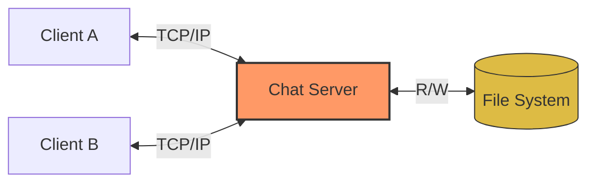
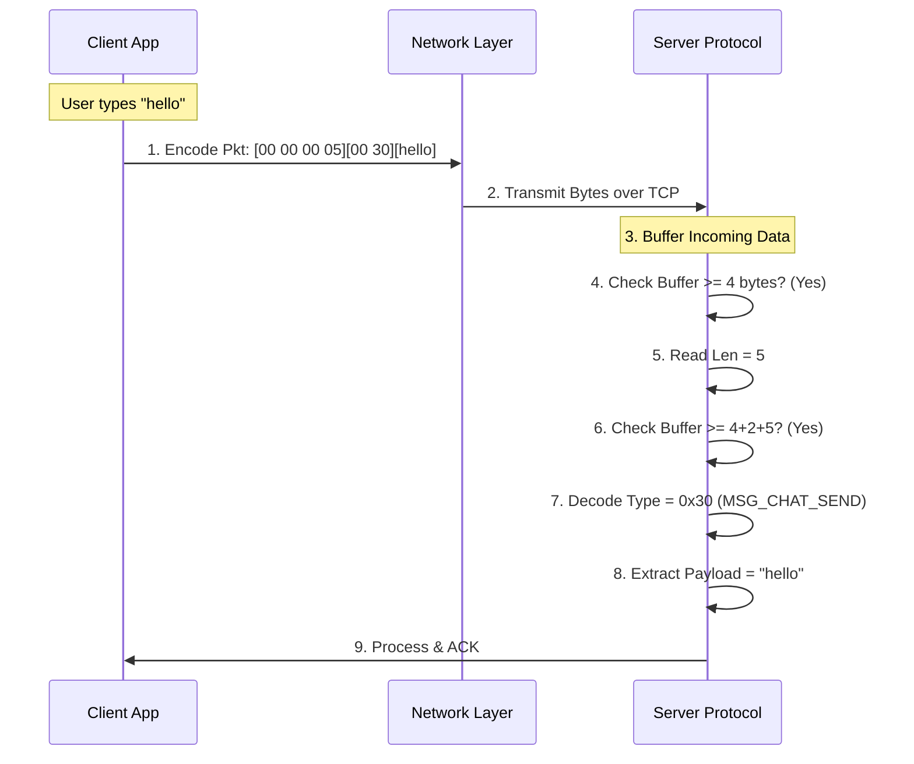
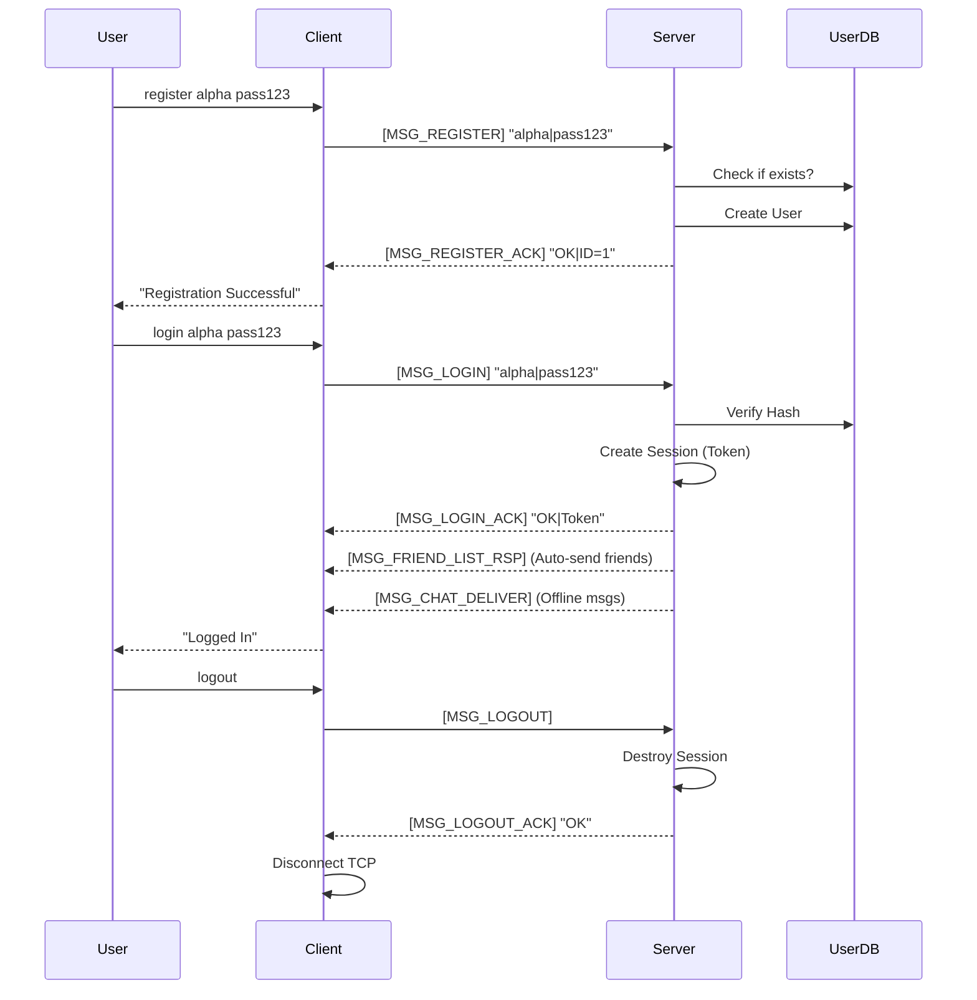
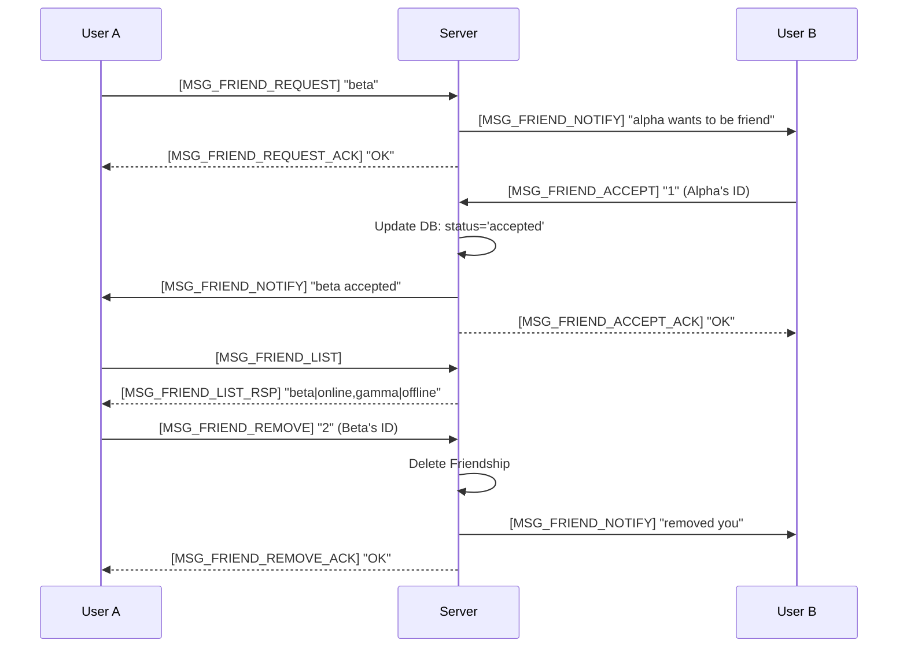
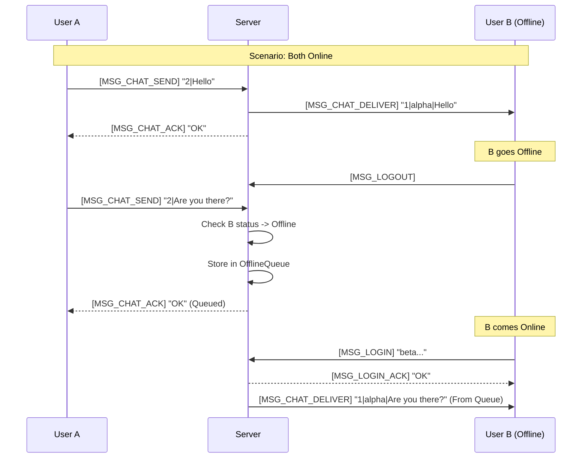
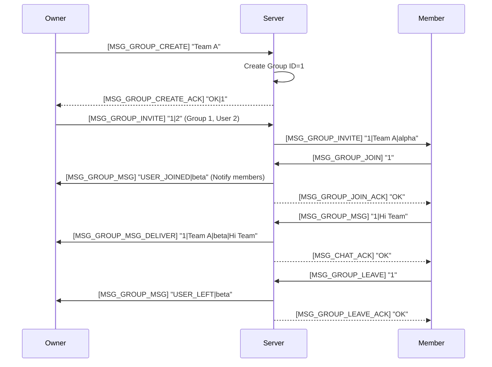

# TCP Chat Socket Architecture & Protocol Flows

````carousel


## 1. System Overview

The TCP Chat Project is a robust Client-Server application designed for reliability and concurrency.

- **Server**: C-based, uses `select()` for non-blocking I/O. Handles 100+ concurrent clients.
- **Client**: Multi-threaded (Sender/Receiver separation).
- **Security**: Basic authentication with password hashing.
- **Protocol**: Custom binary protocol (TLV-style).


<!-- slide -->
## 2. General Packet Transmission

How a message travels from Client to Server.
*Requirement: Reliable TCP framing.*

**Packet Structure**: `[Len (4B)][Type (2B)][Payload (NB)]`


<!-- slide -->
## 3. Authentication Requirements (Req 3, 4, 16)

Covers Registration, Login, and Logout flows.


<!-- slide -->
## 4. Friend System Requirements (Req 5, 6, 7, 8)

Managing relationships: Request, List, Accept, Remove.


<!-- slide -->
## 5. Chat & Offline Messaging (Req 9, 10)

Direct P2P messaging with offline store-and-forward.


<!-- slide -->
## 6. Group Chat System (Req 11-15)

Complex flow: Create, Invite/Join, Message, Leave.


````
