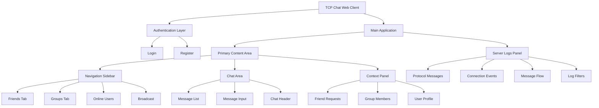
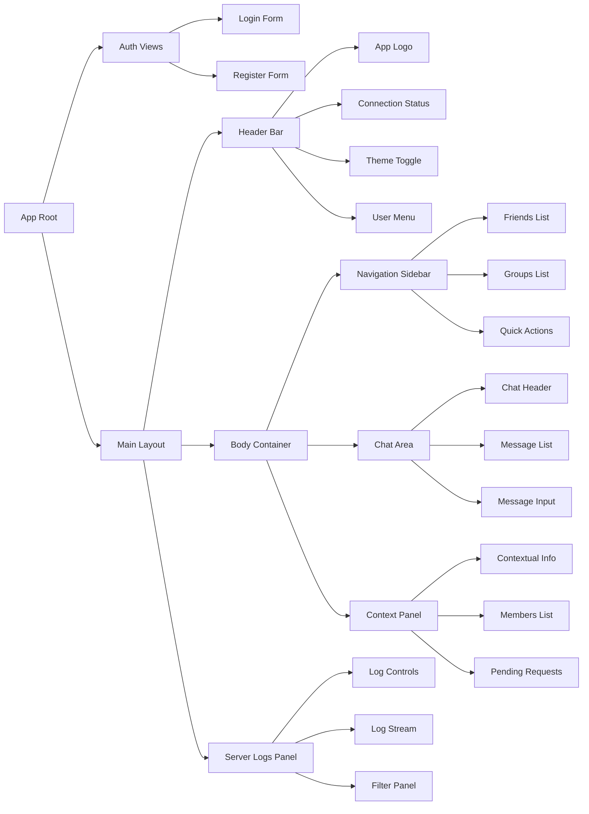
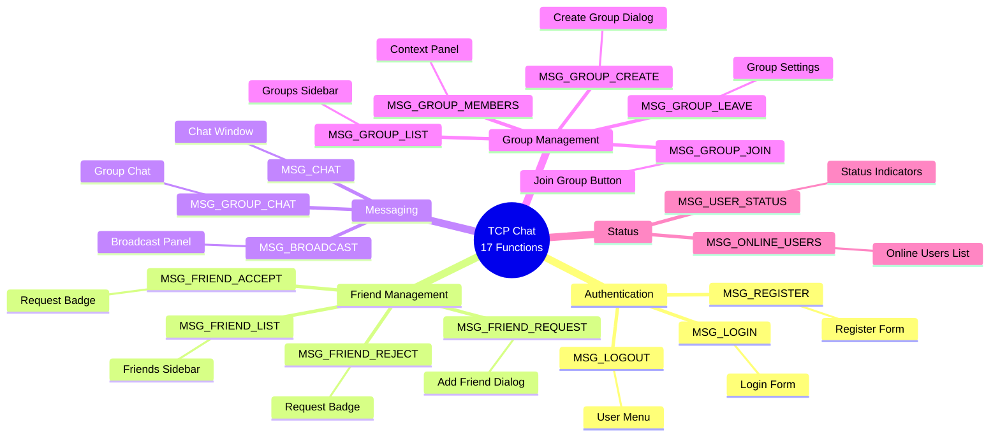

# TCP Chat Web Client - UI/UX Redesign Plan

## Executive Summary

This document outlines a comprehensive UI/UX redesign for the TCP Chat Application web client, focusing on creating an educational, developer-friendly interface that showcases the underlying C server functionality while maintaining modern design aesthetics and usability principles.

**Key Design Goal**: Create a beautiful, functional chat application that transparently displays server operations for educational purposes.

---

## Design Research & Market Analysis

### Current Trends (2025)

Based on research from Dribbble, Behance, and leading design platforms, the following trends inform this redesign:

#### Chat Application Design Patterns
- **Dark mode as default**: 80% of users spend 2+ hours on devices; dark mode reduces eye strain and saves up to 67% power on OLED displays
- **Message bubbles optimization**: Well-designed bubbles increase engagement by 72%
- **Real-time indicators**: Status indicators boost user involvement by 40%
- **Micro-interactions**: Essential for modern app feel - button pulses, sliding menus, typing indicators
- **Dark grey (#121212) over pure black**: Better depth perception and reduced eye strain

#### Developer Tools UI Patterns
- **Split-panel layouts**: Console/logs on side or bottom, main content in center
- **Syntax highlighting**: Color-coded logs for different message types
- **Collapsible panels**: User-controlled information density
- **Real-time log streaming**: Live updates with auto-scroll and pause functionality
- **Filter and search**: Essential for debugging and educational purposes

### Color Psychology for Educational Tools

```json
{
  "authentication": { "bg": "#e8f5e8", "stroke": "#2e7d32", "purpose": "Trust & Security" },
  "messaging": { "bg": "#e3f2fd", "stroke": "#1976d2", "purpose": "Communication & Clarity" },
  "groups": { "bg": "#f3e5f5", "stroke": "#7b1fa2", "purpose": "Community & Collaboration" },
  "friends": { "bg": "#fff3e0", "stroke": "#f57c00", "purpose": "Warmth & Connection" },
  "server_logs": { "bg": "#1e1e1e", "stroke": "#4ec9b0", "purpose": "Technical & Professional" },
  "errors": { "bg": "#ffebee", "stroke": "#d32f2f", "purpose": "Alert & Warning" }
}
```

---

## Architecture Overview

### Information Architecture



### Component Hierarchy



---

## Layout Structure

### Desktop Layout (1440px+)

```
┌──────────────────────────────────────────────────────────────────────────────────────┐
│  HEADER (64px height)                                                      [=] [-] [x]│
│  🔷 TCP Chat   ●Connected   [☀️/🌙]  👤 Username  [↓]                               │
├─────────┬────────────────────────────────────────────────┬────────────┬──────────────┤
│         │                                                │            │              │
│   NAV   │         CHAT AREA (Primary Content)           │  CONTEXT   │ SERVER LOGS  │
│ SIDEBAR │                                                │   PANEL    │    PANEL     │
│ (280px) │                                                │  (320px)   │   (400px)    │
│         │                                                │            │  [TOGGLE]    │
│ ┌─────┐ │  ┌──────────────────────────────────────────┐ │            │              │
│ │Friends│ │  │ Chat Header: [User/Group Name]  [⚙️]  │ │ ┌────────┐ │ ┌──────────┐ │
│ └─────┘ │  └──────────────────────────────────────────┘ │ │Friend  │ │ │ Filters  │ │
│         │                                                │ │Requests│ │ └──────────┘ │
│ • Alice │  ┌──────────────────────────────────────────┐ │ │        │ │              │
│ • Bob   │  │                                          │ │ │ 🔔 3   │ │ MSG_LOGIN    │
│ • Carol │  │        MESSAGE LIST                      │ │ │pending │ │ > Response   │
│         │  │                                          │ │ └────────┘ │ MSG_CHAT     │
│ ┌─────┐ │  │  [Timestamp] [Avatar] Message...        │ │            │ > Deliver    │
│ │Groups│ │  │                                          │ │ ┌────────┐ │ MSG_FRIEND   │
│ └─────┘ │  │  Scrollable message history...          │ │ │Group   │ │ > Accept     │
│         │  │                                          │ │ │Members │ │              │
│ • Team  │  └──────────────────────────────────────────┘ │ │        │ │ [Auto-scroll]│
│ • Study │                                                │ │ 👤 5   │ │ [Export]     │
│         │  ┌──────────────────────────────────────────┐ │ │members │ │ [Clear]      │
│ [+ New] │  │ Type message...              [📎] [😊]  │ │ └────────┘ │              │
│         │  │                                    [Send]│ │            │              │
│ Broadcast│  └──────────────────────────────────────────┘ │            │              │
│ Online   │                                                │            │              │
│ Users    │                                                │            │              │
└─────────┴────────────────────────────────────────────────┴────────────┴──────────────┘
```

### Tablet Layout (768px - 1439px)

```
┌──────────────────────────────────────────────────────────────────────────┐
│  HEADER (64px)                                               [☀️] [👤] [≡]│
├──────────────────────────────────────────────────────────────────────────┤
│                                                                          │
│                    CHAT AREA (Full Width)                               │
│  [≡] Navigation          Chat Header: Alice                    [⚙️] [📊]│
│                                                                          │
│  ┌────────────────────────────────────────────────────────────────────┐ │
│  │                                                                    │ │
│  │                      MESSAGE LIST                                 │ │
│  │                                                                    │ │
│  │  [Timestamp] [Avatar] Message content...                         │ │
│  │                                                                    │ │
│  └────────────────────────────────────────────────────────────────────┘ │
│                                                                          │
│  ┌────────────────────────────────────────────────────────────────────┐ │
│  │ Type message...                              [📎] [😊]      [Send]│ │
│  └────────────────────────────────────────────────────────────────────┘ │
│                                                                          │
└──────────────────────────────────────────────────────────────────────────┘

Server Logs Panel: Drawer from bottom (toggleable)
Context Panel: Drawer from right (toggleable)
Navigation: Drawer from left (toggleable)
```

### Mobile Layout (320px - 767px)

```
┌────────────────────────────┐
│  [≡] TCP Chat      [👤] [⋮]│
├────────────────────────────┤
│                            │
│   Alice                [<] │
│                            │
│ ┌────────────────────────┐ │
│ │                        │ │
│ │   MESSAGE LIST         │ │
│ │                        │ │
│ │ [10:30] Hello!         │ │
│ │                        │ │
│ │         Hi there [10:31│ │
│ │                        │ │
│ └────────────────────────┘ │
│                            │
│ ┌────────────────────────┐ │
│ │ Type...    [📎] [Send] │ │
│ └────────────────────────┘ │
│                            │
└────────────────────────────┘

Bottom Navigation Bar:
[💬 Chat] [👥 Friends] [🎪 Groups] [📊 Logs]
```

---

## Feature Organization by Function

### 17 Core Functions Mapped to UI



---

## Server Logs Panel Design (CRITICAL)

### Purpose
Display real-time C server protocol messages for educational purposes, allowing students to observe:
- Binary/text protocol messages
- Server responses and acknowledgments
- Connection lifecycle events
- Message routing and delivery
- Error states and handling

### Layout & Positioning

**Desktop**: Right-side panel, 400px width, full height, collapsible
**Tablet**: Bottom drawer, 40vh height when expanded
**Mobile**: Full-screen modal overlay

### Panel Structure

```
┌─────────────────────────────────────┐
│ SERVER LOGS            [−] [↓] [×]  │ ← Header with minimize, download, close
├─────────────────────────────────────┤
│ [🔍 Search] [⚙️ Filters] [⏸️ Pause] │ ← Controls
├─────────────────────────────────────┤
│                                     │
│ ┌─ MSG_LOGIN ──────────────────┐   │
│ │ ⏰ 14:32:15.234              │   │
│ │ ← Request                     │   │
│ │ {                             │   │
│ │   "type": "MSG_LOGIN",        │   │
│ │   "username": "alice",        │   │
│ │   "password": "***"           │   │
│ │ }                             │   │
│ │ → Response (120ms)            │   │
│ │ {                             │   │
│ │   "status": "success",        │   │
│ │   "session_id": "abc123"      │   │
│ │ }                             │   │
│ └───────────────────────────────┘   │
│                                     │
│ ┌─ MSG_CHAT ────────────────────┐   │
│ │ ⏰ 14:32:47.891              │   │
│ │ ← Send                        │   │
│ │ From: alice → To: bob         │   │
│ │ Message: "Hello!"             │   │
│ │ → Delivered (45ms)            │   │
│ └───────────────────────────────┘   │
│                                     │
│                                     │
│ [Auto-scroll: ON] [◀ 127 logs]     │ ← Footer status
└─────────────────────────────────────┘
```

### Log Entry Design

Each log entry follows this structure:

```html
<div class="log-entry log-type-{category}">
  <div class="log-header">
    <span class="log-type-badge">{MSG_TYPE}</span>
    <span class="log-timestamp">{HH:mm:ss.SSS}</span>
    <button class="log-expand">▼</button>
  </div>

  <div class="log-body">
    <div class="log-direction">← Request / → Response</div>
    <div class="log-metadata">
      From: {source} → To: {destination}
      Latency: {ms}ms
    </div>
    <pre class="log-payload">{JSON formatted data}</pre>
  </div>
</div>
```

### Color Coding by Message Category

| Category | Color | Messages |
|----------|-------|----------|
| Authentication | `#2e7d32` (Green) | MSG_REGISTER, MSG_LOGIN, MSG_LOGOUT |
| Friend Operations | `#f57c00` (Orange) | MSG_FRIEND_REQUEST, MSG_FRIEND_ACCEPT, MSG_FRIEND_REJECT, MSG_FRIEND_LIST |
| Messaging | `#1976d2` (Blue) | MSG_CHAT, MSG_GROUP_CHAT, MSG_BROADCAST |
| Group Operations | `#7b1fa2` (Purple) | MSG_GROUP_CREATE, MSG_GROUP_JOIN, MSG_GROUP_LEAVE, MSG_GROUP_LIST, MSG_GROUP_MEMBERS |
| Status Queries | `#0288d1` (Cyan) | MSG_ONLINE_USERS, MSG_USER_STATUS |
| Errors | `#d32f2f` (Red) | Any error responses |
| System Events | `#616161` (Grey) | Connection, disconnection, heartbeat |

### Filter Options

```
☑️ Authentication
☑️ Friend Management
☑️ Messaging
☑️ Group Management
☑️ Status Queries
☑️ Errors
☑️ System Events

Time Range: [Last 5 min ▼]
User Filter: [All users ▼]
```

### Interactive Features

1. **Collapsible entries**: Click to expand/collapse JSON payload
2. **Copy to clipboard**: Button to copy log data
3. **Pause/Resume**: Freeze log stream for inspection
4. **Auto-scroll**: Toggle automatic scrolling to latest
5. **Export**: Download logs as JSON or TXT
6. **Search**: Full-text search across all logs
7. **Timestamp hover**: Show relative time (e.g., "2 minutes ago")
8. **Performance metrics**: Response time badges

---

## Component Specifications

### 1. Authentication Components

#### Login Form
```
┌─────────────────────────────────┐
│                                 │
│         🔷 TCP Chat             │
│     Network Programming Demo    │
│                                 │
│  ┌─────────────────────────┐   │
│  │ 👤 Username             │   │
│  └─────────────────────────┘   │
│                                 │
│  ┌─────────────────────────┐   │
│  │ 🔒 Password             │   │
│  └─────────────────────────┘   │
│                                 │
│  ☑️ Remember me                 │
│                                 │
│  ┌─────────────────────────┐   │
│  │      Login              │   │
│  └─────────────────────────┘   │
│                                 │
│  Don't have account? Register  │
│                                 │
└─────────────────────────────────┘
```

**Features**:
- Validation: Real-time field validation
- Error display: Inline error messages
- Loading state: Spinner on button during auth
- Auto-focus: Username field on mount
- Enter key: Submit on Enter press

#### Register Form
```
┌─────────────────────────────────┐
│     Create New Account          │
│                                 │
│  ┌─────────────────────────┐   │
│  │ 👤 Username (4-20 chars)│   │
│  └─────────────────────────┘   │
│  ✓ Available                    │
│                                 │
│  ┌─────────────────────────┐   │
│  │ ✉️ Email               │   │
│  └─────────────────────────┘   │
│                                 │
│  ┌─────────────────────────┐   │
│  │ 🔒 Password (8+ chars)  │   │
│  └─────────────────────────┘   │
│  [████████░░] Strength: Good    │
│                                 │
│  ┌─────────────────────────┐   │
│  │ 🔒 Confirm Password     │   │
│  └─────────────────────────┘   │
│                                 │
│  ┌─────────────────────────┐   │
│  │    Create Account       │   │
│  └─────────────────────────┘   │
│                                 │
│  Already registered? Login     │
└─────────────────────────────────┘
```

**Features**:
- Username availability check (debounced)
- Password strength indicator
- Confirm password matching validation
- Email format validation
- Terms & conditions checkbox (optional)

### 2. Navigation Sidebar (280px)

```
┌─────────────────────────┐
│  FRIENDS          [+ ✉️] │ ← Tab header with actions
├─────────────────────────┤
│  🔍 Search friends...   │
├─────────────────────────┤
│                         │
│  ● Alice Wong     [💬]  │ ← Online (green dot)
│    Last seen: Active    │
│                         │
│  ● Bob Chen       [💬]  │
│    Last seen: Active    │
│                         │
│  ◯ Carol Smith    [💬]  │ ← Offline (grey dot)
│    Last seen: 2h ago    │
│                         │
│  ◯ David Lee      [💬]  │
│    Last seen: 1d ago    │
│                         │
│  ─────────────────────  │
│  PENDING REQUESTS  (3)  │ ← Collapsible section
│  ─────────────────────  │
│                         │
│  Emma wants to be       │
│  your friend            │
│         [✓ Accept] [× Reject]│
│                         │
└─────────────────────────┘

┌─────────────────────────┐
│  GROUPS           [+ 🎪] │ ← Tab header
├─────────────────────────┤
│  🔍 Search groups...    │
├─────────────────────────┤
│                         │
│  🎪 Team Project  (5)   │ ← Member count
│     Last: Alice: "Ok!"  │
│     2 min ago           │
│                         │
│  🎪 Study Group   (8)   │
│     Last: Bob: "Thanks" │
│     1h ago              │
│                         │
│  ─────────────────────  │
│  DISCOVER GROUPS        │
│  ─────────────────────  │
│                         │
│  🔓 Public Group 1      │
│     12 members          │
│         [+ Join]        │
│                         │
└─────────────────────────┘

┌─────────────────────────┐
│  ONLINE USERS     (24)  │
├─────────────────────────┤
│  🔍 Search users...     │
├─────────────────────────┤
│                         │
│  ● Alice Wong           │
│  ● Bob Chen             │
│  ● Emma Wilson          │
│  ● Frank Garcia         │
│  ● Grace Kim            │
│  ... +19 more           │
│                         │
│  ─────────────────────  │
│  BROADCAST MESSAGE      │
│  ─────────────────────  │
│                         │
│  📢 Send to all online  │
│  ┌───────────────────┐ │
│  │ Type message...   │ │
│  └───────────────────┘ │
│  [Broadcast to 24]    │
│                         │
└─────────────────────────┘
```

**Interaction States**:
- **Hover**: Background highlight, action buttons appear
- **Active**: Selected friend/group with accent border
- **Unread**: Bold text, unread count badge
- **Typing indicator**: "Alice is typing..." animation

### 3. Chat Area (Primary Content)

#### Chat Header
```
┌───────────────────────────────────────────────────────┐
│ [<] 👤 Alice Wong  ● Online                   [⚙️] [⋮]│
│     Last seen: Active                                 │
└───────────────────────────────────────────────────────┘
```

**Actions Menu (⋮)**:
- View profile
- Mute notifications
- Clear chat history
- Block user
- Report

#### Message List
```
┌─────────────────────────────────────────────────────┐
│                                   Today, 14:30      │
│                                                     │
│  ┌────────────────────────────────────┐            │
│  │ 👤 Hey! How's the project going?   │  10:15 ✓✓ │
│  └────────────────────────────────────┘            │
│            ┌──────────────────────────────────┐    │
│  10:16 ✓✓  │ Going well! Almost done with UI │ 👤 │
│            └──────────────────────────────────┘    │
│  ┌────────────────────────────────────┐            │
│  │ Great! Let me know when ready      │  10:17 ✓  │
│  └────────────────────────────────────┘            │
│            ┌──────────────────────────────────┐    │
│  10:18     │ Will do! Should be today       │ 👤 │
│            └──────────────────────────────────┘    │
│                                                     │
│         Alice is typing...                         │
└─────────────────────────────────────────────────────┘
```

**Message Status Indicators**:
- `○` Sending
- `✓` Delivered to server
- `✓✓` Delivered to recipient
- `✓✓` (blue) Read by recipient

#### Message Input
```
┌─────────────────────────────────────────────────────┐
│ [📎] ┌─────────────────────────────────────┐ [😊]  │
│      │ Type your message...                │ [Send]│
│      │                                     │       │
│      └─────────────────────────────────────┘       │
│ [Shift+Enter for new line]                         │
└─────────────────────────────────────────────────────┘
```

**Features**:
- Auto-resize: Expands up to 5 lines
- File attachment: Click 📎 to upload
- Emoji picker: Click 😊 for emoji panel
- Mention autocomplete: Type @ to mention
- Markdown support: Basic formatting
- Send on Enter: Shift+Enter for new line

### 4. Context Panel (320px)

Dynamic content based on current view:

#### Friend Chat Context
```
┌─────────────────────────┐
│  FRIEND REQUESTS   🔔 3 │
├─────────────────────────┤
│                         │
│  👤 Emma Wilson         │
│  "Hi! Found you via..."│
│  [✓ Accept] [× Reject] │
│                         │
│  👤 Frank Garcia        │
│  [✓ Accept] [× Reject] │
│                         │
│  👤 Grace Kim           │
│  [✓ Accept] [× Reject] │
│                         │
│  [View all]             │
└─────────────────────────┘

┌─────────────────────────┐
│  USER PROFILE           │
├─────────────────────────┤
│                         │
│      [Avatar]           │
│    Alice Wong           │
│    @alice_w             │
│                         │
│  ● Online               │
│  Member since Jan 2025  │
│                         │
│  ─────────────────────  │
│  SHARED GROUPS (2)      │
│  • Team Project         │
│  • Study Group          │
│  ─────────────────────  │
│                         │
│  [Mute] [Block]         │
└─────────────────────────┘
```

#### Group Chat Context
```
┌─────────────────────────┐
│  GROUP INFO             │
├─────────────────────────┤
│                         │
│    🎪 Team Project      │
│    Created by Bob       │
│    Jan 15, 2025         │
│                         │
│  MEMBERS (5)            │
│  ─────────────────────  │
│  👤 Bob Chen (Admin)    │
│  👤 Alice Wong          │
│  👤 Carol Smith         │
│  👤 David Lee           │
│  👤 Emma Wilson         │
│                         │
│  [+ Add Members]        │
│                         │
│  ─────────────────────  │
│  GROUP ACTIONS          │
│  ─────────────────────  │
│  [Mute Notifications]   │
│  [Leave Group]          │
│  [Report]               │
│                         │
└─────────────────────────┘
```

### 5. Header Bar (64px height)

```
┌──────────────────────────────────────────────────────────────────────┐
│  🔷 TCP Chat   ● Connected (24 users)   [☀️/🌙]  👤 Username  [↓]  │
└──────────────────────────────────────────────────────────────────────┘
   ├─Logo      ├─Status              ├─Theme    ├─User Menu
```

**Components**:

1. **Logo & Brand** (left)
   - App icon + name
   - Clickable to return home

2. **Connection Status** (left-center)
   - `● Connected` (green) - Active connection
   - `● Connecting` (yellow) - Establishing connection
   - `● Disconnected` (red) - No connection
   - Tooltip shows: WebSocket URL, online users count

3. **Theme Toggle** (right-center)
   - ☀️ Light mode
   - 🌙 Dark mode
   - Smooth transition animation

4. **User Menu** (right)
   - Avatar + username
   - Dropdown:
     - Profile settings
     - Preferences
     - View server logs
     - Help & documentation
     - Logout

---

## Responsive Behavior

### Breakpoints

| Breakpoint | Width | Layout Changes |
|------------|-------|----------------|
| Mobile | 320px - 767px | Single column, bottom nav, drawers |
| Tablet | 768px - 1439px | Hide context panel, collapsible sidebar |
| Desktop | 1440px+ | Full layout with all panels |
| Large Desktop | 1920px+ | Wider chat area, more log entries visible |

### Collapsible Panels Priority

When screen space is limited, panels collapse in this order:

1. **First to hide**: Context Panel → becomes modal overlay
2. **Second to hide**: Server Logs Panel → becomes bottom drawer
3. **Third to hide**: Navigation Sidebar → becomes left drawer
4. **Always visible**: Header Bar + Chat Area

### Touch Gestures (Mobile/Tablet)

- **Swipe right**: Open navigation drawer
- **Swipe left**: Open logs drawer (from right edge)
- **Pull down**: Refresh/load older messages
- **Long press**: Message actions menu

---

## Design System

### Typography

**Font Stack**:
```css
/* Display/Headings */
--font-display: 'Space Grotesk', 'Inter', system-ui, sans-serif;

/* Body Text */
--font-body: 'Inter', -apple-system, BlinkMacSystemFont, 'Segoe UI', sans-serif;

/* Monospace (Logs) */
--font-mono: 'JetBrains Mono', 'Fira Code', 'Consolas', monospace;

/* Vietnamese Support */
Note: Ensure all selected fonts support Vietnamese diacritics
```

**Type Scale**:
```css
--text-xs: 0.75rem;    /* 12px - timestamps, metadata */
--text-sm: 0.875rem;   /* 14px - secondary text */
--text-base: 1rem;     /* 16px - body text */
--text-lg: 1.125rem;   /* 18px - emphasis */
--text-xl: 1.25rem;    /* 20px - headings */
--text-2xl: 1.5rem;    /* 24px - page titles */
--text-3xl: 1.875rem;  /* 30px - hero text */
```

### Color Palette

#### Light Mode
```css
--color-bg-primary: #ffffff;
--color-bg-secondary: #f5f5f5;
--color-bg-tertiary: #e0e0e0;

--color-text-primary: #1e1e1e;
--color-text-secondary: #616161;
--color-text-tertiary: #9e9e9e;

--color-border: #e0e0e0;
--color-border-focus: #1976d2;

--color-accent: #1976d2;
--color-accent-hover: #1565c0;
```

#### Dark Mode
```css
--color-bg-primary: #121212;
--color-bg-secondary: #1e1e1e;
--color-bg-tertiary: #2a2a2a;

--color-text-primary: #e0e0e0;
--color-text-secondary: #b0b0b0;
--color-text-tertiary: #757575;

--color-border: #2a2a2a;
--color-border-focus: #42a5f5;

--color-accent: #42a5f5;
--color-accent-hover: #64b5f6;
```

#### Semantic Colors
```css
--color-success: #2e7d32;
--color-warning: #f57c00;
--color-error: #d32f2f;
--color-info: #0288d1;

--color-online: #4caf50;
--color-away: #ff9800;
--color-offline: #757575;
```

### Spacing System

```css
--space-1: 0.25rem;  /* 4px */
--space-2: 0.5rem;   /* 8px */
--space-3: 0.75rem;  /* 12px */
--space-4: 1rem;     /* 16px */
--space-5: 1.25rem;  /* 20px */
--space-6: 1.5rem;   /* 24px */
--space-8: 2rem;     /* 32px */
--space-10: 2.5rem;  /* 40px */
--space-12: 3rem;    /* 48px */
```

### Border Radius

```css
--radius-sm: 0.25rem;  /* 4px - badges, tags */
--radius-md: 0.5rem;   /* 8px - buttons, inputs */
--radius-lg: 0.75rem;  /* 12px - cards, panels */
--radius-xl: 1rem;     /* 16px - modals, dialogs */
--radius-full: 9999px; /* Circular - avatars */
```

### Shadows

```css
--shadow-sm: 0 1px 2px rgba(0, 0, 0, 0.05);
--shadow-md: 0 4px 6px rgba(0, 0, 0, 0.1);
--shadow-lg: 0 10px 15px rgba(0, 0, 0, 0.1);
--shadow-xl: 0 20px 25px rgba(0, 0, 0, 0.15);
```

### Animation & Transitions

```css
--transition-fast: 150ms ease-out;
--transition-base: 200ms ease-out;
--transition-slow: 300ms ease-out;

--ease-in: cubic-bezier(0.4, 0, 1, 1);
--ease-out: cubic-bezier(0, 0, 0.2, 1);
--ease-in-out: cubic-bezier(0.4, 0, 0.2, 1);
```

---

## Micro-interactions

### Message Send Animation
```
1. User clicks Send button
2. Button: Scale down (0.95) → Scale up (1.0) [150ms]
3. Message: Fade in from bottom [200ms]
4. Input: Clear and refocus
5. Message list: Smooth scroll to bottom [300ms]
```

### Friend Request Notification
```
1. New request arrives via WebSocket
2. Badge: Pop animation (scale 0 → 1.2 → 1.0) [300ms]
3. Toast: Slide in from top-right [200ms]
4. Sound: Notification chime (optional)
5. Tab: Pulse "Friends" tab [1s]
```

### Typing Indicator
```
1. User starts typing
2. Send "typing" event (debounced 500ms)
3. Show "Username is typing..." below messages
4. Animated dots: • → •• → ••• (repeating)
5. Fade out after 3s of no activity
```

### Connection Status Change
```
1. Connection lost
2. Header status: Green → Yellow → Red [300ms each]
3. Show reconnecting toast
4. Retry connection (3s intervals)
5. On reconnect: Status → Green, toast "Reconnected"
```

### Theme Toggle
```
1. User clicks theme button
2. Icon: Rotate 180deg [300ms]
3. Colors: Smooth transition [500ms]
4. Save preference to localStorage
5. Apply to all components simultaneously
```

---

## Accessibility Standards

### WCAG 2.1 AA Compliance

#### Color Contrast
- **Normal text**: Minimum 4.5:1 ratio
- **Large text**: Minimum 3:1 ratio
- **Interactive elements**: Minimum 3:1 ratio against background

#### Keyboard Navigation
```
Tab Order:
1. Header navigation
2. Main navigation sidebar
3. Chat area (messages)
4. Message input
5. Context panel
6. Server logs panel

Shortcuts:
- Ctrl/Cmd + K: Focus search
- Ctrl/Cmd + N: New conversation
- Ctrl/Cmd + L: Toggle logs panel
- Ctrl/Cmd + /: Show shortcuts
- Esc: Close modals/drawers
- Arrow keys: Navigate lists
```

#### Screen Reader Support
- **Semantic HTML**: Use appropriate tags (`<nav>`, `<main>`, `<aside>`)
- **ARIA labels**: All interactive elements labeled
- **Live regions**: Announce new messages, status changes
- **Focus management**: Logical focus order, visible focus indicators
- **Alternative text**: All icons have descriptive labels

#### Focus Indicators
```css
:focus-visible {
  outline: 2px solid var(--color-accent);
  outline-offset: 2px;
  border-radius: var(--radius-md);
}
```

---

## Performance Optimization

### Lazy Loading
- **Messages**: Virtualized list, load 50 at a time
- **Images**: Lazy load message attachments
- **Logs**: Windowed rendering, show last 100 entries

### Debouncing & Throttling
- **Search input**: 300ms debounce
- **Typing indicator**: 500ms debounce
- **Scroll events**: 100ms throttle
- **Window resize**: 150ms throttle

### Code Splitting
```javascript
// Route-based splitting
const Login = lazy(() => import('./components/Auth/Login'));
const ChatArea = lazy(() => import('./components/Chat/ChatArea'));
const ServerLogs = lazy(() => import('./components/Logs/ServerLogs'));
```

### Memoization
```javascript
// Expensive computations
const sortedFriends = useMemo(() =>
  friends.sort((a, b) => a.status - b.status),
  [friends]
);

// Component optimization
export default memo(MessageItem, (prev, next) =>
  prev.message.id === next.message.id &&
  prev.message.status === next.message.status
);
```

---

## Implementation Phases

### Phase 1: Foundation (Week 1)
- [ ] Setup design system (colors, typography, spacing)
- [ ] Create base layout structure
- [ ] Implement responsive grid
- [ ] Build header bar component
- [ ] Add theme toggle functionality

### Phase 2: Authentication (Week 1)
- [ ] Design login form
- [ ] Design registration form
- [ ] Implement form validation
- [ ] Add loading states
- [ ] Connect to WebSocket auth

### Phase 3: Core Chat (Week 2)
- [ ] Build navigation sidebar
- [ ] Create chat area layout
- [ ] Implement message list
- [ ] Add message input component
- [ ] Handle message send/receive

### Phase 4: Advanced Features (Week 2)
- [ ] Friend management UI
- [ ] Group chat interface
- [ ] Context panel components
- [ ] Online users list
- [ ] Broadcast functionality

### Phase 5: Server Logs Panel (Week 3) ⭐ CRITICAL
- [ ] Design logs panel layout
- [ ] Implement log streaming
- [ ] Add syntax highlighting
- [ ] Create filter system
- [ ] Build export functionality
- [ ] Add search capability

### Phase 6: Polish & Optimization (Week 3)
- [ ] Add micro-interactions
- [ ] Implement animations
- [ ] Optimize performance
- [ ] Accessibility audit
- [ ] Mobile refinements
- [ ] Testing & bug fixes

---

## Technical Implementation Notes

### State Management Structure

```typescript
// authStore.ts
interface AuthState {
  user: User | null;
  isAuthenticated: boolean;
  sessionId: string | null;
  login: (credentials) => Promise<void>;
  logout: () => void;
}

// friendsStore.ts
interface FriendsState {
  friends: Friend[];
  pendingRequests: FriendRequest[];
  addFriend: (username) => Promise<void>;
  acceptRequest: (id) => Promise<void>;
  rejectRequest: (id) => Promise<void>;
}

// logsStore.ts ⭐ NEW
interface LogsStore {
  logs: ServerLog[];
  filters: LogFilters;
  isPaused: boolean;
  addLog: (log) => void;
  clearLogs: () => void;
  toggleFilter: (category) => void;
  exportLogs: (format: 'json' | 'txt') => void;
}
```

### WebSocket Event Handlers

```typescript
// Handle incoming server logs
wsClient.on('message', (data) => {
  const { type, payload, metadata } = data;

  // Add to logs store for educational display
  logsStore.addLog({
    timestamp: Date.now(),
    type,
    direction: metadata.isRequest ? 'request' : 'response',
    payload,
    latency: metadata.latency,
    source: metadata.source,
    destination: metadata.destination,
  });

  // Handle message in application logic
  handleMessage(type, payload);
});
```

### Component File Structure

```
src/
├── components/
│   ├── Auth/
│   │   ├── Login.tsx
│   │   ├── Register.tsx
│   │   └── AuthLayout.tsx
│   │
│   ├── Chat/
│   │   ├── ChatWindow.tsx
│   │   ├── MessageList.tsx
│   │   ├── MessageItem.tsx
│   │   ├── MessageInput.tsx
│   │   └── TypingIndicator.tsx
│   │
│   ├── Friends/
│   │   ├── FriendList.tsx
│   │   ├── FriendItem.tsx
│   │   ├── FriendRequest.tsx
│   │   └── AddFriendDialog.tsx
│   │
│   ├── Groups/
│   │   ├── GroupList.tsx
│   │   ├── GroupItem.tsx
│   │   ├── GroupChat.tsx
│   │   ├── CreateGroupDialog.tsx
│   │   └── GroupMembersList.tsx
│   │
│   ├── Layout/
│   │   ├── Header.tsx
│   │   ├── Sidebar.tsx
│   │   ├── ContextPanel.tsx
│   │   └── MainLayout.tsx
│   │
│   ├── Logs/  ⭐ NEW
│   │   ├── ServerLogsPanel.tsx
│   │   ├── LogEntry.tsx
│   │   ├── LogFilters.tsx
│   │   ├── LogSearch.tsx
│   │   └── LogExport.tsx
│   │
│   └── Common/
│       ├── Avatar.tsx
│       ├── Badge.tsx
│       ├── Button.tsx
│       ├── Input.tsx
│       ├── StatusIndicator.tsx
│       └── Toast.tsx
```

---

## Testing Strategy

### Component Testing
```typescript
// MessageItem.test.tsx
describe('MessageItem', () => {
  it('renders message content correctly', () => {});
  it('shows timestamp in correct format', () => {});
  it('displays delivery status icon', () => {});
  it('applies correct styling for own messages', () => {});
});

// ServerLogsPanel.test.tsx ⭐ CRITICAL
describe('ServerLogsPanel', () => {
  it('renders log entries in correct order', () => {});
  it('filters logs by category', () => {});
  it('pauses/resumes log stream', () => {});
  it('exports logs in JSON format', () => {});
  it('highlights search matches', () => {});
});
```

### Integration Testing
- WebSocket connection and reconnection
- Message send/receive flow
- Friend request lifecycle
- Group creation and messaging
- Server log capture and display

### Accessibility Testing
- Keyboard navigation
- Screen reader announcements
- Color contrast validation
- Focus management

---

## Success Metrics

### User Experience
- [ ] Login to chat in < 3 clicks
- [ ] Send message in < 2 seconds
- [ ] Theme toggle responds instantly
- [ ] All actions have visual feedback
- [ ] No layout shift on panel toggle

### Educational Value ⭐
- [ ] Server logs visible within 1 click
- [ ] All 17 message types color-coded
- [ ] Request/response latency displayed
- [ ] Filter logs by category in < 2 clicks
- [ ] Export logs for offline study

### Performance
- [ ] Initial load: < 2 seconds
- [ ] Message render: < 50ms
- [ ] Log entry render: < 30ms
- [ ] Theme switch: < 300ms
- [ ] Smooth 60fps animations

### Accessibility
- [ ] WCAG 2.1 AA compliant
- [ ] Full keyboard navigation
- [ ] Screen reader compatible
- [ ] High contrast mode support

---

## Appendix

### Design Inspiration Sources

1. [Dribbble Chat App Designs](https://dribbble.com/tags/chat-app) - Modern chat UI patterns
2. [Behance Chat UI Projects](https://www.behance.net/search/projects/chat%20ui) - Complete design systems
3. [Muzli Chat UI Examples](https://muz.li/inspiration/chat-ui/) - 60+ curated examples
4. [BrixLabs Design Patterns](https://bricxlabs.com/blogs/message-screen-ui-deisgn) - 16 chat UI patterns
5. [Logdy Web Logs Viewer](https://logdy.dev/blog/post/web-based-logs-viewer-ui-for-local-development-environment) - Developer console inspiration
6. [SST Console Logs UI](https://sst.dev/blog/new-console-logs-ui/) - Modern log viewer design

### Technical References

1. [Chrome DevTools Console](https://developer.chrome.com/docs/devtools/console/log/) - Console design patterns
2. [Open WebUI Logging](https://docs.openwebui.com/getting-started/advanced-topics/logging/) - Frontend/backend logging
3. [Quarkus Dev UI](https://quarkus.io/guides/dev-ui) - Live log view patterns

### Color Accessibility Tools

- [WebAIM Contrast Checker](https://webaim.org/resources/contrastchecker/)
- [Colorable](https://colorable.jxnblk.com/)
- [Color Safe](http://colorsafe.co/)

### Font Resources

- [Google Fonts](https://fonts.google.com/) - Filter by "Vietnamese" language support
- [Font Pair](https://www.fontpair.co/) - Beautiful font combinations

---

## Conclusion

This redesign transforms the TCP Chat Application from a functional tool into an **educational showcase** that beautifully demonstrates network programming concepts through transparent server log visualization.

**Key Differentiators**:
1. **Educational Focus**: Real-time server logs panel shows protocol in action
2. **Modern Aesthetics**: Dark mode default, micro-interactions, polished UI
3. **Accessibility**: WCAG 2.1 AA compliant from day one
4. **Scalability**: Handles 100+ friends, multiple groups, thousands of logs
5. **Developer Experience**: Clear component structure, type-safe, maintainable

**Next Steps**:
1. Review and approve this design plan
2. Create high-fidelity mockups in Figma (optional)
3. Begin Phase 1 implementation
4. Iterate based on user testing feedback

**Questions for Stakeholders**:
- Should we add a tutorial/onboarding flow for new users?
- Do we need a demo mode with pre-populated data?
- Should logs be persistent across sessions (localStorage)?
- Any specific branding/color preferences for the educational context?

---

*Document Version: 1.0*
*Last Updated: 2025-12-19*
*Author: UI/UX Design Team*
*Project: TCP Chat Application - Network Programming Education*
